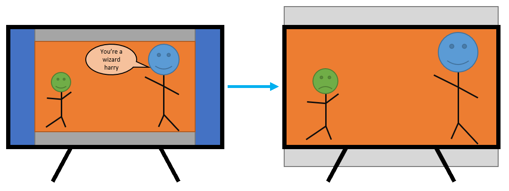

# Video Zoom
A very simple browser utility to zoom in on videos in the web browser.
Can add the minified script as a bookmark in your browser, and scale videos with the click of a button.

## Why?
Sometimes when streaming video content on the internet, it has annoying black bars around the video.
Not too sure of the reason for this, but it's noticeable in older movies that were shot in a wider format, and then originally
displayed on 4:3 screens.

This script simply applies a `scale` transform style to the video element itself, causing it to expand from the centre point.
The black bars will be hidden outside of the video viewport, as the actual video takes up more of the screen.

For example, here's a real photo taken of Harry. The video originally takes up the orange+grey parts of the screen. Blue is the unused space due to the 4:3 aspect ratio of the video in a 16:9 screen. The movie was filmed in 16:9 for example, but then black borders were added to make the video 4:3.
By zooming in about 30% (1.3 scale factor) the video content (orange) is scaled up to fill the entire screen. 



I've noticed this particularly with an ultra-wide screen. Video streams fail to fully utilize the larger screen space due to these black bars.

## How to use
You can copy-paste the [script](./main.js) directly into the dev console in your browser (try pressing F12 to make it appear).

Alternatively, you can create a bookmark in your browser, with the URL `javascript:<codehere>`.
For example, `javascript:alert("Test")` would show an alert box each time you click on it.

If instead, you bookmark the contents of the minified [main.min.js](./main.min.js) file, it will run that script.

```
javascript:!function(){let a=null;var l=document.getElementsByTagName('video');if(null!==l&&0==l.length)a=l[0];else if(null!==l&&0<l.length){let e=Array.from(l).map(e=>{var l=e.getBoundingClientRect();return{area:l.width*l.height,el:e}});var n=e.sort((e,l)=>e.area-l.area);a=n[0].el}if(null!==a&&null!=a){let e=a.style.transform||'',l=/scale\(([\d.]+)\)/,t=1.34;n=l.exec(e);null!=n&&2==n.length&&(r=Number.parseFloat(n[1]),isNaN(r)?console.log(`Found existing scale of '${n[1]}' but failed to parse it`):t=r);var n=prompt('Set video scale',`${t}`),r=Number.parseFloat(n);isNaN(r)?alert(`'${n}' is not a valid number`):(r=`scale(${r})`,e=l.test(e)?e.replace(l,r):0==e.length?r:e.endsWith(';')?`${e} ${r};`:`${e}; ${r};`,console.log(`New transform attribute is ${e}`),a.style.transform=e)}else alert('Video element not found')}();
```

The script will try to find the largest video on the page, then it asks you what scale value you now want.
I've found that a value around 1.3-1.4 works well to remove these black border.

You can try using the [index.html](./index.html) file to create the bookmark too.

## Requirements
- HTML5 enabled web browser. This uses the `transform: scale` property. See Mozilla documentation [here](https://developer.mozilla.org/en-US/docs/Web/CSS/transform-function/scale()).

## Fun fact
This should work on a mobile device too. Create a bookmark as mentioned above, and trigger the bookmark (e.g. in Chrome, search for the bookmark name to execute it).